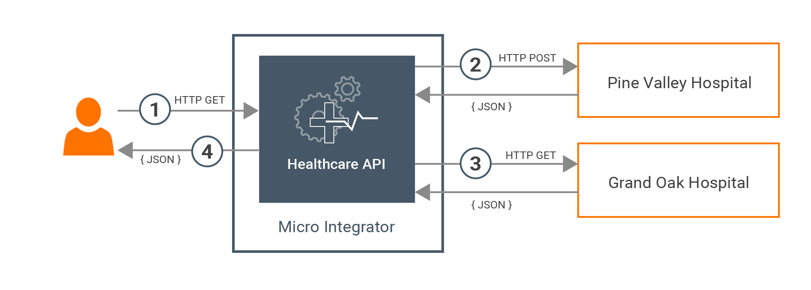
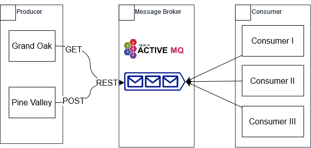

# ActiveMQ Exploration

## Problem Statement


Most healthcare centers have a system that is used to make doctor appointments. To check the availability of the doctors for a particular time, users typically need to visit the hospitals or use each and every online system that is dedicated for a particular healthcare center. Here, we are making it easier for patients by orchestrating those isolated systems for each healthcare provider and exposing a single interface to the users.

For thorough explanation, please visit [Quick Start Guide](https://github.com/wso2/docs-ei/blob/master/en/micro-integrator/docs/overview/quick-start-guide.md).

## How To Run

1. Install ActiveMQ via this [link](https://activemq.apache.org/components/classic/download/)
or you can also unzip the one in this git repo.
2. Export it and put it in your working folder
3. To activate the ActiveMQ, execute ```cd apache*/apache*/ & bin\activemq start```
4. Clone this repository ```git clone https://github.com/rannnayy/activeMQ-exploration.git```
5. Activate the back end mock up ```java -jar .\DoctorInfo-JDK11.jar```
6. Firstly, fill the message queue by the data obtained from the backend.
```node rsPineValley.js```<br>
```node rsGrandOak.js```
7. Secondly, when the queue is filled, activate the hospital app by typing
```node hp.js```

The HospitalApp will then retrieve the data in the Message Queue without dequeueing them.

# Explanation



The diagram above depicts the solution we built. The message broker retrieve the data from both back ends, then store them. Then, the client can obtain the data from the queue.

# The Team
* Maharani Ayu Putri Irawan / 13520019
* Muhammad Risqi Firdaus / 13520043
* Dimas Shidqi Parikesit / 13520087